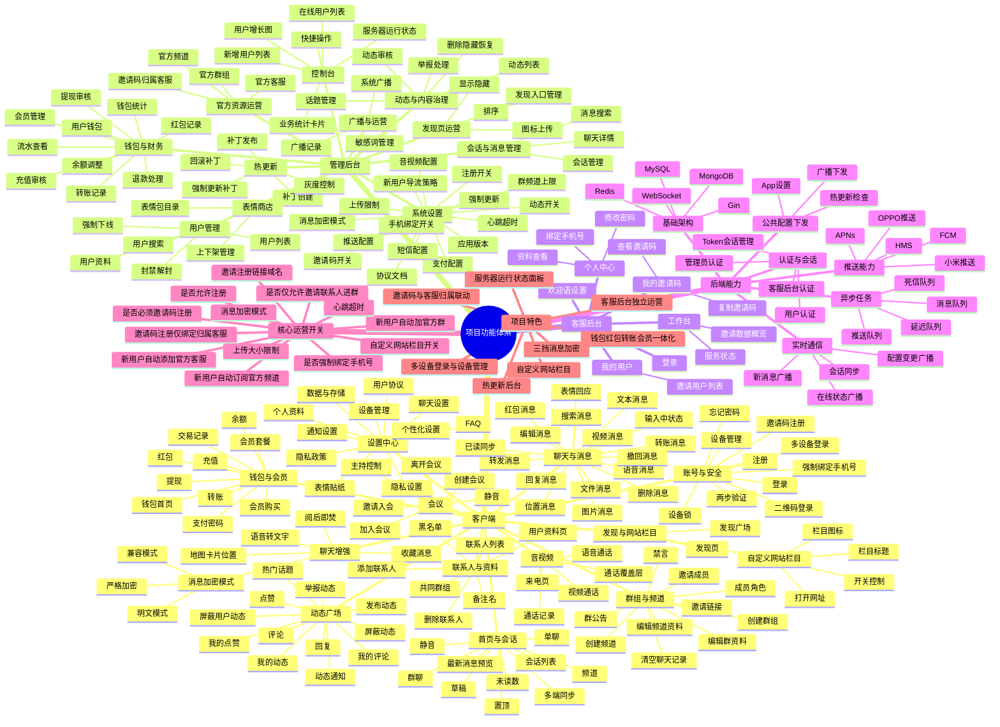

# 项目功能思维导图

> 更新时间：2026-05-06  
> 说明：可直接在支持 Mermaid 的 Markdown 编辑器中查看

## 结构说明

- 客户端：面向用户使用的全部业务能力
- 管理后台：面向总后台运营与管理
- 客服后台：面向官方客服的邀请码与欢迎语运营
- 后端能力：技术层与服务支撑层
- 核心运营开关：后台最关键的全局控制项
- 项目特色：当前项目相对普通 IM 的差异化能力
